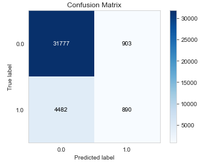
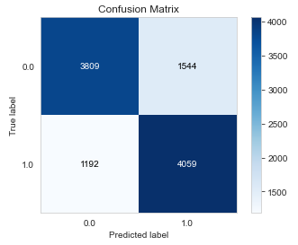
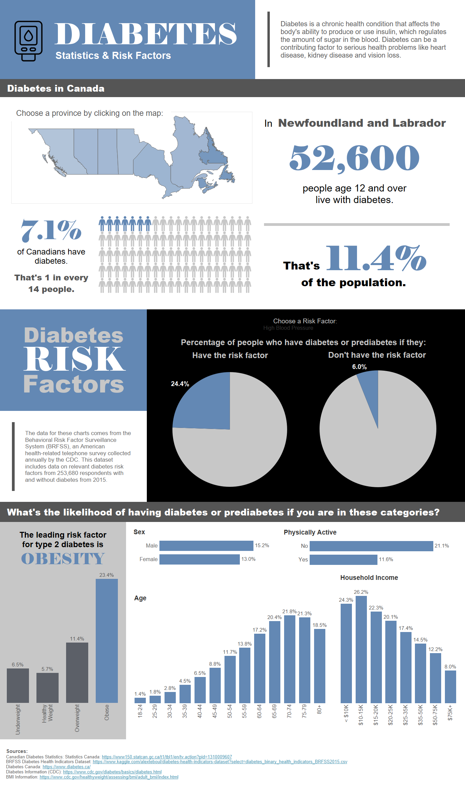

# Diabetes Classification Project

## Introduction

The aim of this project is to create a model that predicts the presence of diabetes or prediabetes based on the answers to 21 health survey questions. The data comes from the 2015 Behavioral Risk Factor Surveillance System, a health-related telephone survey conducted annually in the United States by the CDC. The full survey contains responses to 330 questions from over 400,000 people. This dataset is a cleaned subset of the full BRFSS survey, containing the responses to questions identified as potential risk factors for diabetes.

**Sources:**

- [Dataset](https://www.kaggle.com/alexteboul/diabetes-health-indicators-dataset) from Kaggle
- [BRFSS 2015 Codebook](https://www.cdc.gov/brfss/annual_data/2015/pdf/codebook15_llcp.pdf)
- [Canadian Diabetes Statisics](https://www150.statcan.gc.ca/t1/tbl1/en/tv.action?pid=1310009607) from Statistics Canada
- Further information about diabetes: [Diabetes Canada](https://www.diabetes.ca/about-diabetes/what-is-diabetes) and [CDC](https://www.cdc.gov/diabetes/basics/diabetes.html)
- [BMI Information](https://www.cdc.gov/healthyweight/assessing/bmi/adult_bmi/index.html)

### Questions:
- Can we make a model to predict whether a person has diabetes based on the risk factors included in the dataset?
- Which factors are most predictive in determining whether a person has diabetes?

## Process & Challenges

### Python
(see Jupyter Notebook [here](https://github.com/lorimcco/Diabetes-Project/blob/main/DiabetesProject.ipynb))

I began by loading the data into a Jupyter Notebook and taking a look at it. The dataset was exceptionally clean with no missing values. I looked at some summary statistics. The most notable discovery was that the dataset was unbalanced, with only 14% of the people surveyed having diabetes or prediabetes.

To answer my first question, I chose a Random Forest Classifier from Scikit-Learn for my classification model. I tuned the n_estimators hyperparameter to improve the model’s accuracy. However, while the model’s accuracy was almost 86%, it was very bad at correctly classifying the 1 class (those who actually had diabetes): it only caught 17% of the true diabetes cases. The high accuracy was only due to the fact that there was so much more support for the 0 class (no diabetes).

I attempted to fix this by hypertuning the class_weight hyperparameter. I used GridSearch to test 200 different weight combinations, but found that there was no optimal weight to improve the model’s ability to detect true diabetes cases: the F1 score continually decreased as the weight for class 1 increased.

My next idea was to use the balanced dataset provided on Kaggle. This made such a big difference! After hypertuning n_estimators, the model correctly predicted 77% of those with diabetes as class 1. The model’s overall accuracy dropped to 74%, but I decided in this context it was more important to correctly classify those with diabetes than to have a higher overall accuracy.

## Tableau
(see interactive Tableau dashboard [here](https://public.tableau.com/app/profile/lorien.mccomb/viz/DiabetesStatsandRiskFactors/Dashboard1?publish=yes))

To examine which features in the dataset have the most value in predicting the presence of diabetes or prediabetes, I made several charts in Tableau. The pie charts and bar charts show the percentage of people who have diabetes given the presence/absence of a feature in the BRFSS dataset. For this dashboard, I learned how to make a dynamic dimension chart where the user can select a feature from the dataset and see how diabetes affects those with and without the chosen risk factor.

I rounded out the dashboard with an interactive map of Canadian diabetes statistics by province.

## Solutions & Analysis

### Can we make a model to predict whether a person had diabetes based on the risk factors included in the dataset?
The Random Forest Classifier with the balanced dataset predicts whether or not a person has diabetes or prediabetes with 74% accuracy. It correctly predicts the presence of diabetes in those who have the disease 77% of the time. Considering that this data comes from a telephone survey, not direct medical tests, I find these results quite impressive! It is not a substitute for a medical diagnosis, but if a person found themselves classified as having diabetes/prediabetes with this model, I would recommend seeing a doctor for diabetes testing.

### Which factors are most predictive in determining whether a person has diabetes?
Some indicators that appear to correlate most strongly with diabetes are:
- high blood pressure 
- difficulty walking 
- obesity (BMI of 30 or higher) 
- advanced age 
- lower household income

**Important note:** These correlations are not intended to imply causation.

I also learned that Atlantic provinces (especially Newfoundland and Labrador) experience higher diabetes rates than anywhere else in Canada.

### Key Learnings
- My biggest takeaway from this project was realizing how much a balanced dataset impacts a model’s ability to correctly classify data.
- I learned how to use GridSearch to tune hyperparameters.
- I learned how to create two new types of charts in Tableau: a unit chart and a chart with a dynamic dimension dropdown menu.
- I also challenged myself to create a more visually striking Tableau dashboard than I ever have before.
